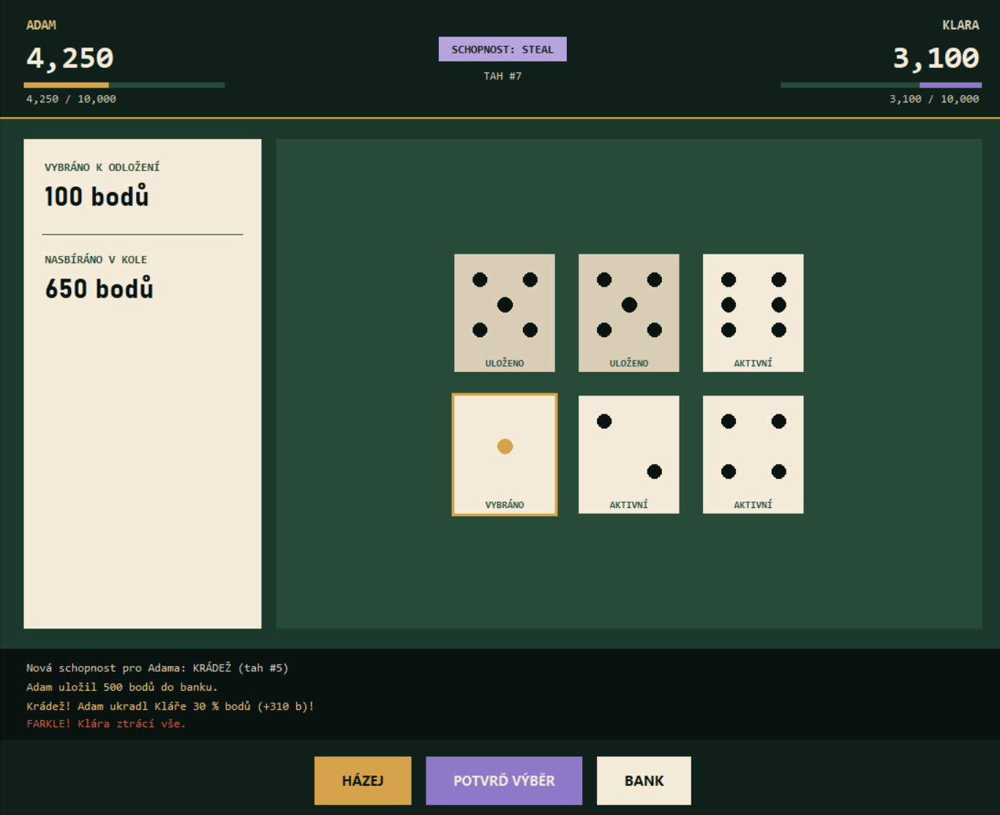

# Farkle se schopnostmi

Tato hra je rozšířenou verzí klasické kostkové hry **Farkle**, obohacenou o **speciální schopnosti hráčů**, které přidávají strategickou hloubku a zvyšují znovuhratelnost.



---

## Jak hru spustit

**Požadavky:** Python 3 s modulem `tkinter` (u instalace z [python.org](https://www.python.org/) je součástí výchozí instalace; na Linuxu může být potřeba doinstalovat balíček `python3-tk`).

```bash
git clone https://github.com/ssestorad/Informatika-2-Projekt-SimonSestorad.git
cd Informatika-2-Projekt-SimonSestorad
python main.py
```

Hra se ovládá myší — kostky se vybírají kliknutím, dál se pokračuje tlačítky HÁZEJ / POTVRĎ VÝBĚR / BANK.

---

## Cíl hry

Cílem hry je být **první hráč**, který dosáhne předem stanoveného počtu bodů (např. **10 000 bodů**).

---

## Pravidla hry

1. Hráč začíná své kolo **hodem všech šesti kostek**.
2. Po každém hodu musí **odložit alespoň jednu bodovanou kostku** (viz bodovací tabulka níže).
3. Se zbývajícími kostkami může:
   * znovu házet a pokusit se získat další body, nebo
   * kdykoli **ukončit kolo** a zapsat si dosud získané body — pokud má hráč v kole nasbíráno alespoň **500 bodů**.
4. Pokud hráč **neodloží žádnou bodovanou kostku**, přichází o **všechny body získané v tomto kole** (tzv. *Farkle*).
5. Pokud hráč **odloží všech 6 kostek**, získává tzv. *horké kostky* a **hází znovu všemi šesti**.
6. Hra pokračuje po směru hodinových ručiček.

---

## Bodovací tabulka

| Kombinace        | Body |
| ---------------- | ---- |
| Jednička (1)     | 100  |
| Pětka (5)        | 50   |
| 3 × dvojka (2)   | 200  |
| 3 × trojka (3)   | 300  |
| 3 × čtyřka (4)   | 400  |
| 3 × pětka (5)    | 500  |
| 3 × šestka (6)   | 600  |
| 3 × jednička (1) | 1000 |
| 3 × dvojice (např. 2-2, 5-5, 6-6) | 1000 |
| Postupka (1-2-3-4-5-6) | 2000 |
| 6 stejných čísel | 5000 |

---

## Schopnosti hráčů

### Pravidla schopností

* Každý hráč získá **první schopnost na začátku hry**.
* **Novou schopnost** získá hráč **každých 5 svých tahů**.
* Schopnosti se aktivují **automaticky**, jakmile nastane jejich podmínka — u většiny hned při získání, u Pojistky a Zrcadlového štítu až v okamžiku, kdy je potřeba (Farkle / útok soupeře).
* Schopnosti **nelze odkládat ani šetřit na později**.
* Každá schopnost se použije **přesně jednou**.

### Přehled schopností

* **DVOJNÁSOBNÍK** – Další zapsaný bank v tomto kole se **zdvojnásobí (×2)**.
* **FAST POINTS** – Okamžitě získáš **+500 bodů k banku**.
* **10% BOOST** – Získáš **+10 % ke svému aktuálnímu celkovému skóre**.
* **SABOTÁŽ** – Vybranému soupeři se **sníží jeho aktuální bank o 50 %**.
* **KRÁDEŽ** – Ukradneš **30 % aktuálního banku soupeře** a přičteš si je ke svému banku.
* **POJISTKA** – Pokud hodíš *Farkle*, nepřijdeš o body nasbírané v daném kole, ale **automaticky se ti uloží**.
* **ZRCADLOVÝ ŠTÍT** – Pasivní obrana. Pokud na tebe někdo použije Sabotáž nebo Krádež, **efekt se obrátí proti němu**.
* **ZMIZÍK** – Úplně vymažeš soupeřův **poslední zapsaný bank**.

---
